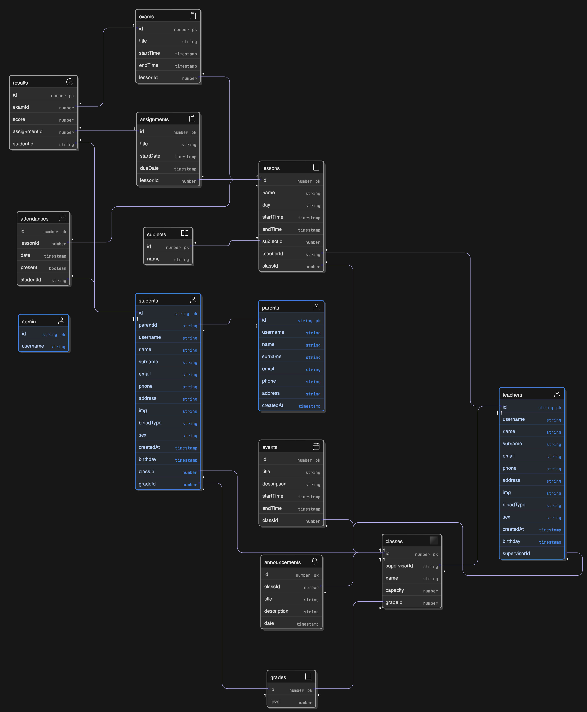

# Hedgie Academy Management System

A modern, full-stack web application designed to streamline the administration of an academy/school. This system provides easy management of teachers, students, subjects, classes, exams, and more — all within an intuitive and responsive dashboard.

---

## ✨ Key Features

### 🔧 **Admin Dashboard**
- Dynamic overview of key statistics: student count, teacher count, class schedules, upcoming exams, events, announcements, etc.
- Interactive charts and visualizations powered by **Recharts.js** for easy data insights.
- List and detailed view of various type of data, including student, teacher, lessons, etc.

---

### 📊 **Data Analytics**
- Real-time summary widgets (e.g., total students/gender distribution, recent attendance).
- Aggregated statistics for management tracking (annual spending and budget, exam results strength, etc.).
- Visual charts powered by **Recharts.js** for easy insights.

---

### 🗂️ **CRUD Management**
The admin can perform CRUD operations on:

- 🧑‍🏫 **Teachers**
- 👩‍🎓 **Students**
- 👩 **Parents**
- 📚 **Subjects**
- 🏫 **Classes**
- 📝 **Exams**
- 📅 **Lessons**
- 📢 **Announcements**
- 🗓️ **Events**
- 🧾 **Results**
- 📝 **Attendance**

---

### 📅 **Schedule Calendar**
- View all scheduled lessons and events by day or week.
- **Teachers** can view their lessons for the week and events associated with their subjects.
- **Students** can view their lessons for the week and upcoming events.
- **Admin** can view all lessons and events for the entire institution.
- Powered by `react-big-calendar` with full timezone and date-handling.

---

### 🔐 **Role-Based Access Control (RBAC)**
- **Admin:** Full access to manage all CRUD features and system settings.
- **Teachers:** Can manage their own classes, subjects, events, announcements, view student performance, and see their weekly/daily class schedule in calendar mode.
- **Students & Parents:** View their own data, grades, lessons, exams, schedules, events, and announcement, etc.
- **Clerk** is used for authentication and role-based access control, ensuring only authorized users can access their respective content.

---

### 🧩 **Tech Stack**

- **Frontend:**  
  - **Next.js** (App Router for scalable routing and server-side rendering)  
  - **TypeScript** (For type safety and better developer experience)  
  - **Tailwind CSS** (Utility-first CSS framework for rapid UI development)  
  - **React Big Calendar** (For lesson scheduling and calendar management)  
  - **React Toastify** (For showing toast notifications)  
  - **Recharts.js** (For creating interactive charts and data visualizations)
  - **Clerk** (Authentication, role management, and access control for users)

- **Backend:**  
  - **Prisma ORM** (Object Relational Mapping for type-safe database queries)  
  - **PostgreSQL** (Relational database to store data for users, lessons, subjects, etc.)  
  - **Docker** (Containerization of the app for easier deployment and development)

- **Cloud Services:**  
  - **Cloudinary** (For managing and hosting images like profile pictures)

---
## 🚀 Deployment Status

This application is under active development and is planned to be deployed soon.
🔧 Deployment pipeline and CI/CD setup are in progress.
✅ Stay tuned for the live production URL.

---

## Database ER Diagram:

 